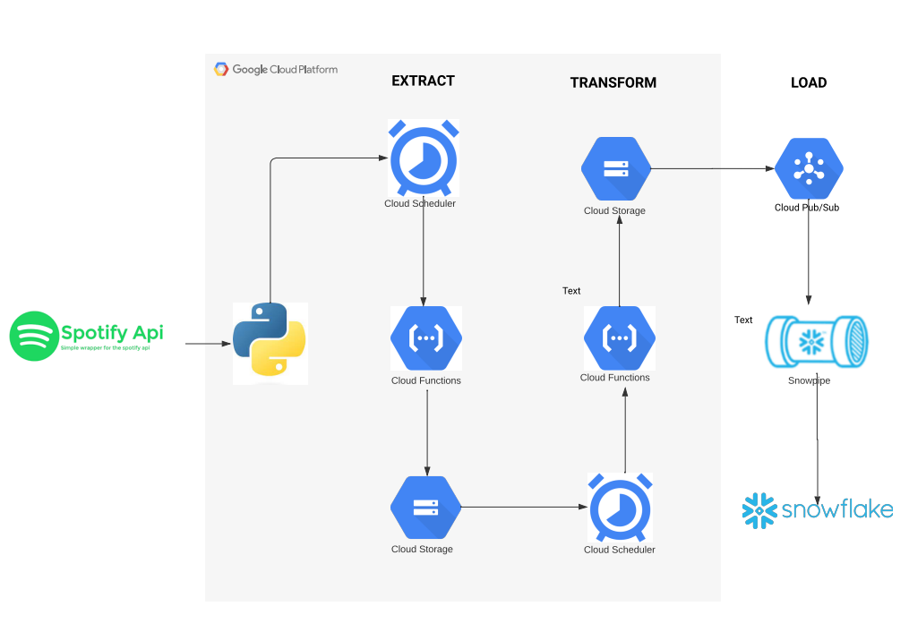
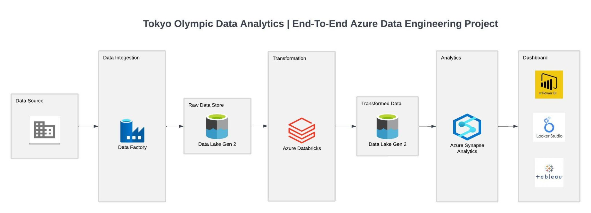
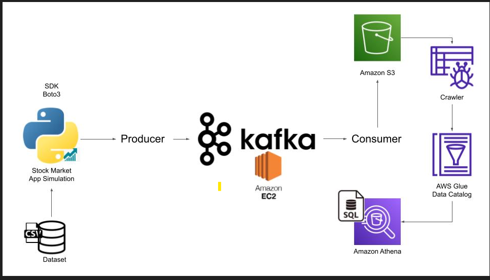
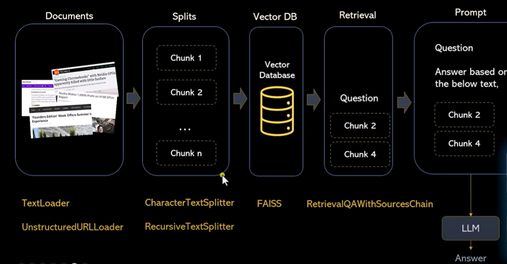

# Riaz Virani

#### Technical Skills: Python, SQL, Snowflake, Microsoft Azure, GCP

## 📍 Denton, Texas

📞 [Phone: +1-3467862412](tel:+1-3467862412)

✉️ [Email: viraniriaz554@gmail.com](mailto:viraniriaz554@gmail.com)

🔗 [LinkedIn: Riaz Virani](https://www.linkedin.com/in/riaz-virani/)

👨‍💻 [GitHub: viraniriaz](https://github.com/viraniriaz)

## About

As an AWS Certified Cloud Practitioner and System Analyst, I specialize in architecting cloud-driven solutions that enhance ERP integrations and streamline business operations. I firmly believe that any repetitive task can be automated using technology, eliminating inefficiencies and improving productivity. With expertise in Ellucian Banner, I analyze business workflows, bridge gaps in ERP systems, and design scalable, automation-driven solutions to optimize processes.

Recognizing that data is the cornerstone of informed decision-making, I leverage SQL, Python, and AWS services to develop secure, high-performance architectures that improve data accessibility and operational efficiency. My passion lies in bridging ERP and cloud technologies, ensuring seamless integration that empowers organizations with intelligent automation, data-driven insights, and future-ready solutions in an evolving digital landscape.

## 💼 Experience

- **Horry-Georgetown Technical College** |  Banner System Analyst | Myrtle Beach, SC 
  Jun 2024 - Present · 10 mos

  -  Develop, implement, and maintain the Ellucian Banner system to support the college's operational and academic goals, optimizing processes and enhancing system functionality.
  - Collaborate with stakeholders to understand and address needs, providing technical support and training to staff and students for an improved user experience.
  - Conduct regular system analysis, troubleshooting, and documentation to ensure optimal performance, reliability, and continuous improvement in line with the latest advancements in the Ellucian Banner suite.

- **Global Encounters** |  Power BI Developer | Remote
  July 2024 - Present · 9 mos

  -  Partnering with cross-functional teams to deliver over 20+ data-driven Power BI dashboards, enabling actionable insights for global arts and sports programming.
  -  Streamlining data visualization for 100+ qualifying events, enhancing transparency and decision-making across festival operations.
  -  Spearheading reporting solutions that support festival programming, impacting thousands of participants across cultures and borders.

- **The Shams Group** |  Software Engineer/Health IT Consultant | Dallas, TX  
  Oct 2023 - May 2024 · 8 mos

  -  Research and propose database solutions tailored to client requirements, focusing on MEDITECH Expanse Health Information Management(HIM)-related software like abstracting, transcription, scanning & archiving, and chart deficiency physician ESign. Customize applications to meet client specifications and maintain HIPAA compliance.
  - Provide specialized troubleshooting for database usage issues in clinical, financial, and ambulatory applications. Collaborate with Help Desk for prompt resolution, following best practices and regulatory guidelines.
  - Coordinate testing across integrated applications in HIM to ensure seamless interoperability. Support system Go Live events, providing on-site assistance to users and addressing any issues to minimize disruptions to client operations.

- **Aces Transportation Company** |  Data and Application Engineer | Remote  
  Oct 2022 - July 2023 · 10 mos

  - Build Software to automate a previously manual and tedious invoicing process, leveraging google sheets, google docs, and google app scripts. Utilized Looker to prepare dashboard for management where they could   visualize key insights. 
  - Improved and optimized existing software by thoroughly evaluating unique goal of each project. Logged all user interaction with application in a SQL database to create an audit trail.

- **University of North Texas** | Graduate Teaching Assistant | Denton, USA  
  Jan 2023 - Dec 2023 · 12 mos

  - Applied pedagogical techniques and Canvas Learning Management Systems (LMS) to boost course participation by 15% and increase assignment completion rates by 10%.
  - Utilized statistical analysis tools (Canvas Analytics) to enhance course content, resulting in a 20% increase in exam scores and a 95% course satisfaction rate among students.

- **University of North Texas** | Course Designer and Data Manager | Denton, USA  
  Jul 2022 - Jan 2023 · 5 mos

  - Enhanced accessibility testing for diverse content, promoting independence and integration for individuals with special challenges.
  - Designed and managed a successful micro-credential program, increasing completion rates, skill proficiency, and program enrollment, with a 95% participant satisfaction rate.

- **Vitario** |  Data Engineer | Remote  
  Dec 2020 - Mar 2022 · 1 yr 4 mos

  - Leveraged customer unstructured & structured data to derive insights and implemented machine learning using bigQuery to predict return customer, thereby increasing marketing ROI 6x. Used Pub/Sub and Dataflow to create real-time data streaming pipeline.
  - Identified different options to build machine learning solutions on Google Cloud. Describe a machine learning workflow and the key steps with Vertex AI and build a machine learning pipeline using AutoML.

## 🔍 Skills

- **Languages:** Python, Structure Query Language(SQL), JavaScript, Selenium, Shell Scripting
- **Enterprise Applications:** Ellucian Banner, Degreeworks, Ultratime, D2L, Atomic UC4
- **Development Frameworks:** Google Collab, Jupyter Notebook, AWS SDK, GCP SDK, Apache Spark, Apache Kafka, Django
- **Analytical Tools/Library:** envision Argos, Power BI, Matplotlib, Pandas, MS Excel, Looker
- **Database:** Oracle, Postgres, MySQL, MongoDB, SQLite
- **Web Technologies:** Rest API, HTML5, CSS, DOM, Bright Data
- **Data Warehouses:** Amazon Redshift, Google BigQuery, Snowflakes, Azure Synapse Analytics, Data Modeling
- **Data Lakes:** Amazon S3, Google Cloud Storage, Azure Data Lake Storage
- **ETL Tools:** Azure Data Factory, AWS Glue, AWS Lambda, Airflow, Google Pub/Sub,Dataflow,Mage
- **Tools & IDE:** MS Office, Postman, Anaconda, PyCharm, Jupyter Notebook, Toad, Visual Studios
- **Cloud Services:** AWS Lamda, Amazon RDS, Amazon SES, API Gateway, AWS Glue, AWS Cognito 

## 🚀 Projects

- **Automated Secure Salary Data Reporting to Credit Bureaus** | July 2024
  Developed an end-to-end automated pipeline to securely transmit employee salary data to credit bureaus, enhancing loan verification efficiency and reducing HR workload.
  - Data Extraction & Processing: Identified and retrieved real-time salary data in required format from the ERP system.
  - Secure File Handling: Encrypted files using the credit bureau’s public key, ensuring 100% compliance with security protocols.
  - Automated Transfer & Authentication: Established a seamless SFTP-based transmission, reducing manual intervention by 95%.
  - Workflow Automation: Integrated with UC4 for job scheduling, automated archival, and real-time notifications to HR and payroll teams.
   

- **Universal Explore Transfer Program Integration** | Sep 2024
  Developed a data integration system for the Universal Explore Transfer Program, improving transfer credit evaluation accuracy and reducing manual verification efforts of registrar by over 30%
  - API Integration: Leveraged ERP APIs with bearer token authentication, ensuring real-time data access for the vendor.
  - Secure Data Transmission: Configured SFTP-based transfer via Argos, enabling data delivery for 100% of required courses not covered by APIs.
  - Collaboration & Implementation: Worked with the vendor and Registrar’s Office to enhance course credit mapping, benefiting thousands of students annually.
  This initiative optimized data flow, improved student decision-making, and streamlined the transfer credit evaluation process without intervention of Registrar.

- **Business Process Improvement** | Oct 2024
   
  HR Automation - Developed an automated hour deduction system for winter and summer breaks, dynamically adjusting deductions based on employee workweeks. Previously, HR manually processed these calculations, consuming significant time and effort. The automation reduced manual processing by 80%, improved accuracy, and allowed HR to focus on higher-value tasks, ensuring a seamless and efficient workflow.

  Payroll Process Improvement - Transformed the faculty summer contract payroll process by automating contract value calculations and ERP population. Previously, payroll relied on Excel-based computations and manual data entry, leading to inefficiencies and more time processing. The new automated workflow eliminated manual inputs, reducing payroll processing time by 70%, improving data accuracy, and streamlining payroll operations for faculty summer contracts.

  Academic Affairs - Automated the faculty position and suffix assignment process for academic affairs, which was previously handled manually for each course. Leveraged ERP processes to dynamically retrieve faculty positions and automate data entry, eliminating manual input. This automation significantly reduced processing time, minimized errors, and enhanced efficiency in academic scheduling and faculty management.

- **Implemented Time Management Systems** | Jan 2025
  Implemented a Time Management System to digitize the time-tracking process for non-exempt employees, replacing manual paper-based records with an automated solution. FLMA regulations require tracking employee work hours and compensating overtime, but since these employees are salaried, their hours should not be directly fed into the payroll system.

  To address this challenge while maintaining compliance, I developed a custom workaround that ensured accurate tracking without impacting payroll calculations. This digital transformation improved record accuracy, ensured regulatory compliance, and eliminated manual errors, making the process more efficient and transparent for workforce management

## 🚀 Data Engineering Projects

- [**Spotify ETL**](https://github.com/viraniriaz/Spotify_ETL) | Sep 2023

  The goal is to get the latest rankings of best Hindi songs in the US, transform the raw API data into analysis-ready tables, and load them into Snowflake.
   
  

- [**Tokyo Olympics Azure Data Engineering Pipeline**](https://github.com/viraniriaz/tokyo-olympic-azure-data-engineering-project) | June 2023

  Using Azure Data Factory, I orchestrated the entire data flow, ensuring seamless extraction and loading processes. The Tokyo Olympics data found its home in Azure Data Storage Gen 2, setting the stage for further transformations.
  

- [**Stock Market Real-Time Data Pipeline**](https://github.com/viraniriaz/stock_market_real_time) | Feb 2023
   
  In this project, I have completed a comprehensive data engineering project involving real-time stock market data by utilizing Kafka for seamless data processing from start to finish.

  

## 🚀 AI/ML Projects

- [**RockyBot**](https://github.com/viraniriaz/langchain) | Oct 2023

  RockyBot is a user-friendly news research tool designed for effortless information retrieval. Users can input article URLs and ask questions to receive relevant insights from the stock market and financial domain.
   
  

## 🎓 Education

- **University of North Texas** | Denton, USA  
  *Master's in Computer Science (CGPA: 4.0)*  
  Jan 2022 - Dec 2023  

- **Osmania University** | Hyderabad, India  
  *Bachelor's in Computer Science (CGPA: 8.13/10)*  
  Aug 2017 - Aug 2021

## 📜 Certifications
- [**AWS Certified Cloud Practitioner**](https://www.credly.com/badges/b5437f8a-2e3d-4ecf-888f-4c16049f51ee/linked_in_profile)
- [**Microsoft Certified: Azure Data Engineer Associate**](https://learn.microsoft.com/en-us/users/RiazVirani-3208/credentials/83801BA081F775DE)
- [**Microsoft Certified: Azure Data Fundamentals**](https://learn.microsoft.com/en-us/users/riazvirani-3208/credentials/d29686a599161ea7)
- [**Modernizing Data Lakes and Data Warehouses with Google Cloud**](https://www.coursera.org/account/accomplishments/verify/35GU7HEBDTVT)

